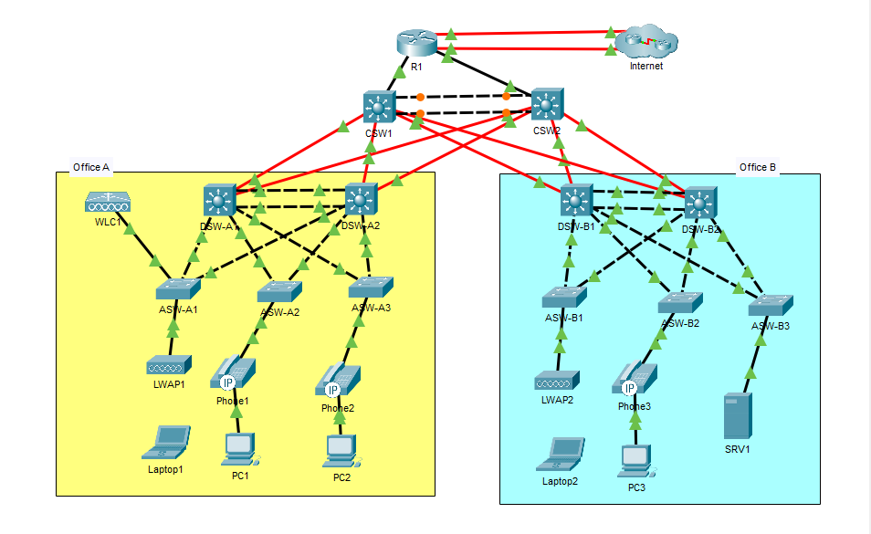
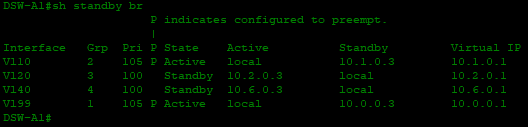

# CCNA  – Three-Tier Office Network

Completed configuration of **Jeremy’s IT Lab CCNA Mega Lab** (full dual-office, three-tier topology).

This lab covers virtually all major CCNA configuration topics in a realistic enterprise-style network.

## Lab Overview

- **Architecture**: Three-tier (Access → Distribution → Core)
- **Sites**: Two offices (Office A & Office B) + shared Core + Edge router
- **Focus**: Redundancy, load balancing, security, and structured design

## Technologies Configured

**Layer 2**
- VLANs & Trunking
- Layer 2 EtherChannel (PAgP / LACP)
- Rapid-PVST with optimized root bridge placement
- PortFast + BPDU Guard

**Layer 3**
- Inter-VLAN routing via SVIs
- HSRP (version 2) for gateway redundancy
- OSPF Area 0
- Layer 3 EtherChannel on Core

**Security**
- Port Security (sticky, restrict)
- DHCP Snooping
- Dynamic ARP Inspection (DAI)
- Extended ACLs
- SSH with access-lists on VTY lines

**Services**
- DHCP (multiple pools for PCs, Phones, Management, Wi-Fi)
- NAT (overload + static)
- NTP
- SNMP
- Syslog

**Wireless**
- WLC + Lightweight Access Points
- WPA2-AES SSID

## Device Configs Included

- R1 (Edge Router)
- CSW1 (Core Switch)
- DSW-A1 (Distribution Switch)
- ASW-A1 (Access Switch)

> Note: The full dual-office topology is configured. Only representative configs from each layer are included in this repository for clarity.

## How to Use

All configurations were built and tested in **Cisco Packet Tracer**.

You can review the `show running-config` outputs in the `/configs` folder.

## Credits

This lab is based on the excellent **Jeremy’s IT Lab CCNA Mega Lab**.  
I completed the full dual-office version and verified the major features end-to-end.

---

*Lab completed as part of CCNA studies.*

## Screenshots

### Topology

### EtherChannel

### HSRP

### OSPF Neighbors

### Port Security

